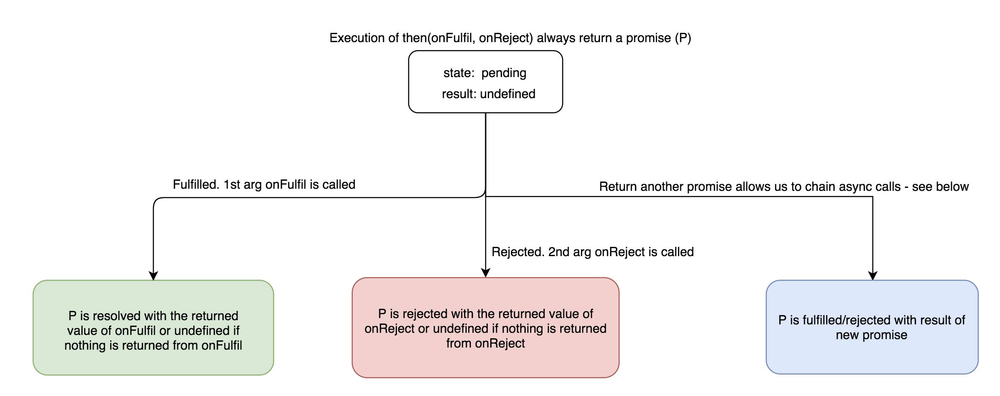

## Async/Await

- [Promise](#promise)
- [Async/Await Summary](#Summary)
- [Async](#async)
- [Turn a sync into async](#Turn-a-sync-into-async)
- [Async in sequence/parallel](#Async-in-sequence-parallel)
- [Throw in catch](#throw-in-catch)
- [Error handling](#error-handling)
- [Notes](#notes)
- [Reference](#reference)

### Promise



```js
loadScript('/article/promise-chaining/one.js')
  .then((script) => loadScript('/article/promise-chaining/two.js'))
  .then((script) => loadScript('/article/promise-chaining/three.js'))
  .then((script) => {
    // scripts are loaded, we can use functions declared there
    one();
    two();
    three();
  });
```

### Summary

- Promise.resolve - Returns a Promise object that is resolved with a given value.

```js
Promise.resolve(x);

// basically same as

new Promise(function (r) {
  r(x);
});
```

- async - The return value of an `async` function is always wrapped in a `Promise.resolve`.
- await - Resolve the promise - an alternate way to do `then()`.

### async

```js
const getBook = async (bookName) => {
  const book = await fetchBook(bookName);

  // simultaneously fetch author and rating
  const [author, rating] = await Promise.all([
    fetchAuthor(book.author_id),
    fetchRating(book.id),
  ]);

  return {
    ...book,
    author,
    rating,
  };
};
```

### Turn a sync into async

```js
function foo() {
  // same as `return 5;`
  return Promise.resolve(5);
}

foo().then(console.log);
```

### Async in sequence and parallel

When the runtime sees `await` it will wait until the await function return value has been resolved before **executing any lines below it**. Compare the two patterns below:

```js
async function orderItems() {
  const items = await getCartItems();
  const noOfItems = items.data.length;

  for (var i = 0; i < noOfItems; i++) {
    const res = await sendRequest(items.data[i]); // execution in sequence
  }

  items.data.forEach(async (i) => {
    const res = await sendRequest(items.data[i]); // execution in parallel
    // you will see five times of ccc being printed all at once. The flow is do sendReq 5 time straight
    // once any one of them gets resolved AND nothing in the call stack, runtime will then pick queued
    // console.log('ccc') and execute them.
    // all that is because forEach inherently expects callback to be a sync function, it doesn't know how to handle async one 
    console.log('ccc');
  });
}
```

### Throw in catch

```js
asyncFunc.then(...).catch((e) => {
  console.log(e);
  throw e;
});
```
This will not exit process but cause `unhandled promise rejection` warning. To kill the process after throwing error, do this

```js
process.on('unhandledRejection', err => {
  console.error((err as Error).message);
  process.exit(1);
});
```

### Error Handling

Simple rule - strictly speaking, async function doesn't throw errors but rather reject the promise with an exception that can be caught by `try/catch` or `catch()`. So use `reject(new Error('new error'))`. NEVER EVER throw error in async function. Do that in sync one.

```js
async function foo() {
  if (false) {
    Promise.reject(new Error('oustide error')); // not ok causing unhandled rejected promise
    return Promise.reject(new Error('oustide error')); // ok
  }

  const result1 = await new Promise((resolve, reject) =>
    setTimeout(() => {
      reject(new Error('inside error')); // don't need to return it
    }, 500),
  );

  console.log(result1); // not execute!
}

foo()
  .then((r) => {
    // console.log(r);
  })
  .catch((err) => {
    console.log('err caught',err);
  });
```

### Notes

One should not throw errors in Promise constructor, instead reject the error.

```js
function getCartItems() {
  return new Promise((resolve, reject) => {
    setTimeout(function () {
      if (false) {
        resolve({
          data: [1, 2, 3, 4, 5],
          id: 1,
        });
      } else {
        throw 'err'; // NO-NO!!
      }
    }, 0);
  });
}
```

Error thrown will not be caught by chaining catch given throw is **sync** while reject is **async**. Calling throw will immediately terminate the program while reject lets program to run normally after marking promise status as rejected.

### Reference

[Promise chaining](https://javascript.info/promise-chaining)
